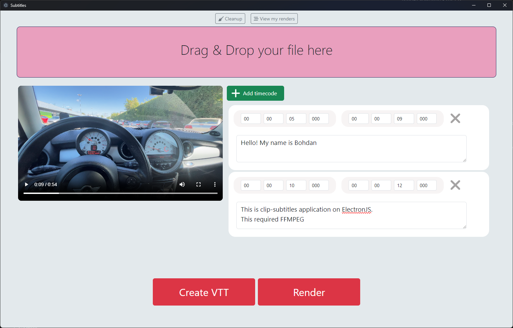

# CLIP-SUBTITLES

Bohdan Vovkotrub - 2023.12

<pre> Keywords: FFMPEG, subtitle, VTT, webvtt-parser-esm </pre>

## What is it ?

It's ElectronJS app for creating subtitles to clips.<br>
You can just create a .VTT file or create new clip with subs.

This application use FFmpeg. <br>
If your PC have NVIDIA gpu it will run more faster.




## Installation

FFmpeg and NodeJS is required!
For install FFmpeg go to: (https://ffmpeg.org/download.html)

After FFmpeg is installed:

```
git clone https://github.com/BohdanVovkotrub/clip-subtitles.git
cd clip-subtitles
```

Or you can download .zip and unpack it then go to the folder.

Download all required node modules:

```
npm install
```

Open ```.env``` and write path to ffmpeg.exe and ffprobe.exe 
If you was added its to system PATH, you can leave it as default.

```
FFMPEG_PATH="ffmpeg"
FFPROBE_PATH="ffprobe"
```

If you have NVIDIA GPU and you want to render using it, set in ```.env```:
```
USE_NVIDIA=1
```
If you want to have all result clip in h264 format, set in ```.env```:
```
FORCE_H264=1
```

## How to run it

For start application:

```
npm start
```

You can build package for your OS.
See: (https://github.com/electron-userland/electron-builder)

Open a terminal with administrative privilegies and run:
```
npm run dist
```
then see to dist/ and build/ folders


## How to use it

After running the Application select your video file using "Drag & Drop" zone or tap it.<br>
After video file is selected click to "Add timecode" for adding timecodes in HH:MM:SS.sss format (see webvtt standart).<br>
Then input your text of this timecode.<br>

After timecodes was added you can click on "Create VTT" for creating .VTT subtitle file or you can click on "Render" for rendering this clip with subs in current folder.<br>
After finish in the folder will be placed a 3 files:
* ```input.mp4```
* ```sub-input.mp4``` - created new file with subs.
* ```input.vtt``` - file with subtitles in WebVTT format.

